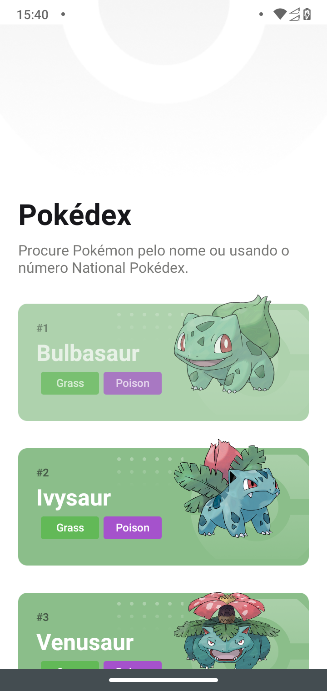
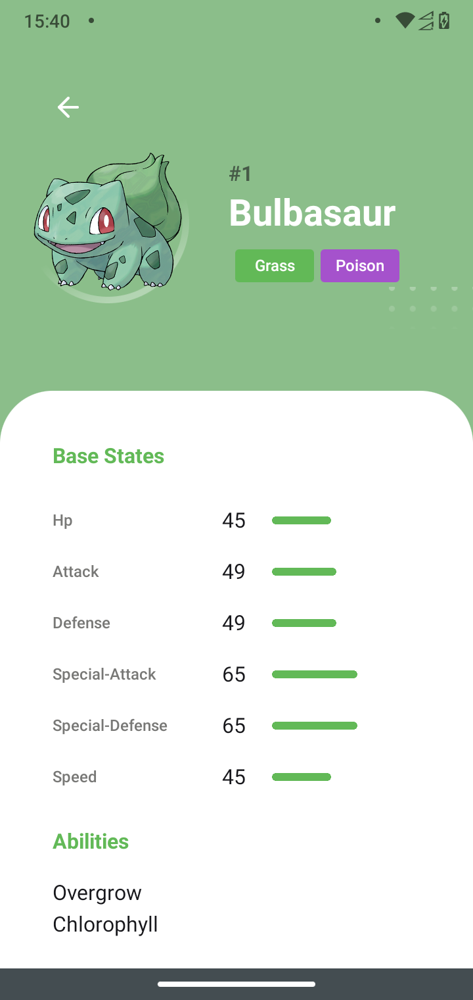

# Pokedex

Aplicação Pokedex em React Native. Tecnologias usadas:

#### tecnologias:

- expo
- axios
- typescript
- styled-components
- react-native-progress
- react-native-reanimated
- react-native-responsive-fontsize

---

## Screenshot

  
  
  

---
